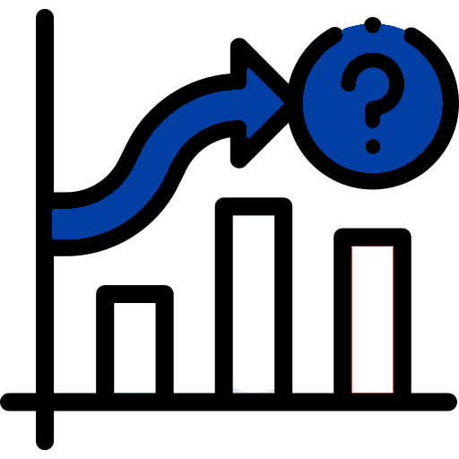
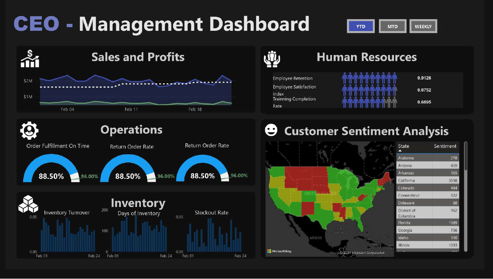
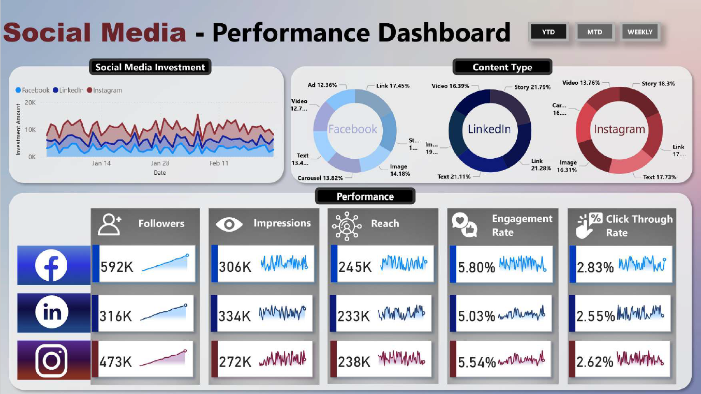
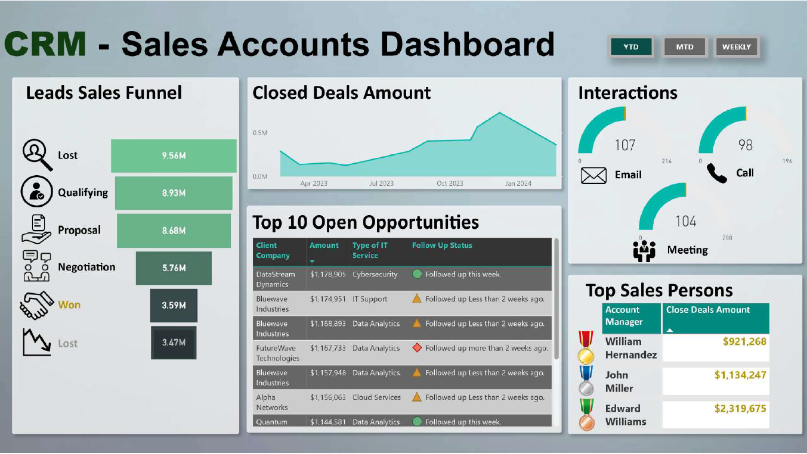
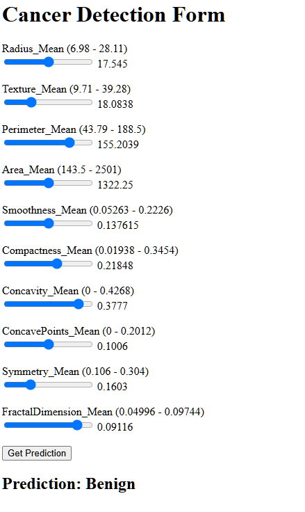
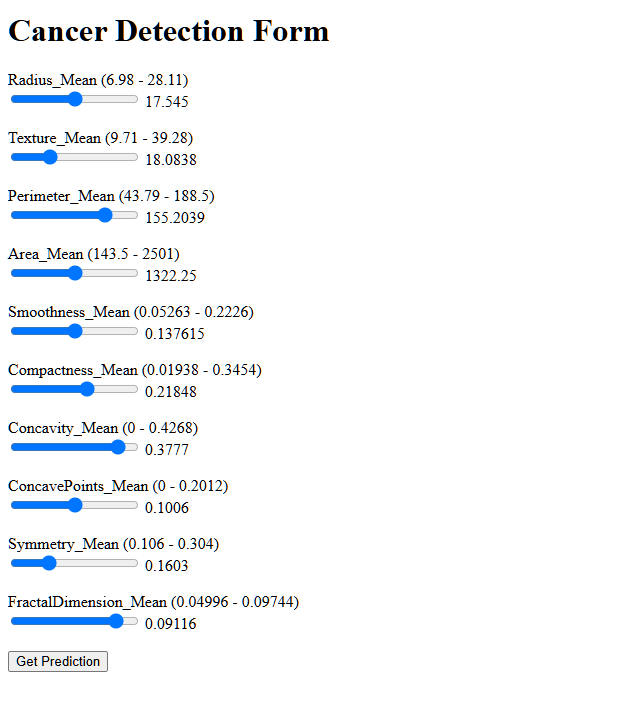

<!-- 💡 Core Skills Section – Full Width with Icon Padding to Hide Image Frame -->
<section style="width: 100vw; margin-left: calc(-50vw + 50%); background-color: #f9f9f9; padding: 4rem 2rem;">
  

    <h2 style="color: #1e2a45; margin-bottom: 2rem;">How I can help your business</h2>

    

      <!-- 🔷 Dashboards -->
      

        
        <h3 style="color: #1e2a45;">Dashboards</h3>
        

          I specialize in building real-time, visually impactful dashboards using Power BI.
          From operational insights to executive reporting, I focus on clarity, accuracy, and actionability — tailored for IT, Retail, and Logistics environments.
        

      

      <!-- 🔷 Data Science -->
      

        
        <h3 style="color: #1e2a45;">Data Science</h3>
        

          I apply forecasting and classification models like linear regression, random forests, and XGBoost to solve business problems.
          Whether predicting demand or identifying churn risk, I bring machine learning into daily decisions.
        

      

    

  

</section>

---

<!-- 🧑‍💼 About Me Section – Second with Custom Blue (#7897b4) -->
<section style="width: 100vw; margin-left: calc(-50vw + 50%); background-color: #7897b4; color: white; padding: 4rem 2rem;">
  

    <!-- Text -->
    

      <h1 style="margin-top: 0; color: white;">About Me</h1>
      

        I’m Julio, a data scientist and analytics architect passionate about transforming messy datasets into strategic insights.
        I specialize in developing ML models, building enterprise dashboards, and deploying cloud-based data solutions using Python, Power BI, and Azure.
      

      

        I've worked with IBM, Reece Group, Dell, and more — and I’m always exploring how to make analytics more accessible and actionable.
      

      

        I’m open to freelance projects, collaborations, and full-time opportunities.
      

    

    <!-- Image -->
    

      
    

  

</section>

---

<!-- 📂 Projects Section with Responsive Grid -->
<section style="padding: 4rem 2rem; max-width: 1200px; margin: auto;">
  <h2 style="text-align: center; color: #1e2a45; margin-bottom: 2rem;">📂 Projects</h2>

  

    <!-- Project 1 -->
    

      
      

        <h3>eCommerce Analytics</h3>
        
Dashboard built for a retail group to track online orders, revenue, and conversion rates in real-time.

      

    

    <!-- Project 2 -->
    

      
      

        <h3>Finance Scorecard</h3>
        
Power BI dashboard for tracking margins, OPEX, and profitability across business units.

      

    

    <!-- Project 3 -->
    

      
      

        <h3>Logistics Insights</h3>
        
Interactive report highlighting delivery performance, warehouse status, and logistics KPIs.

      

    

    <!-- ML Project 1 -->
    

      
      

        <h3>Breast Cancer Predictor</h3>
        
Frontend app using logistic regression and SVM to classify cancer presence from medical data.

      

    

    <!-- ML Project 2 -->
    

      
      

        <h3>Insurance Cost Estimator</h3>
        
Regression model using XGBoost to estimate individual insurance costs from demographic and health data.

      

    

  

</section>

---

## 📬 Contact

- 📧 julio.barajas.c@gmail.com  
- 📄 [Resume](resume.pdf)
